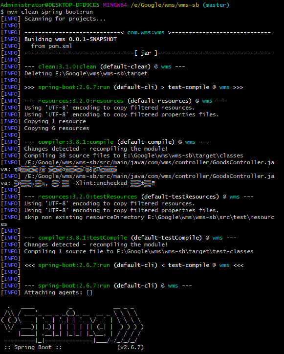
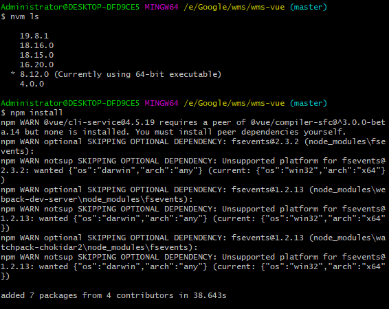
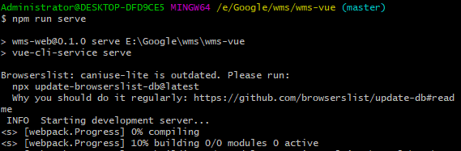
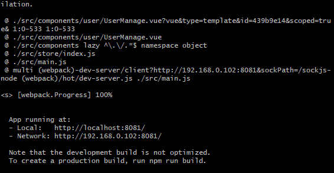
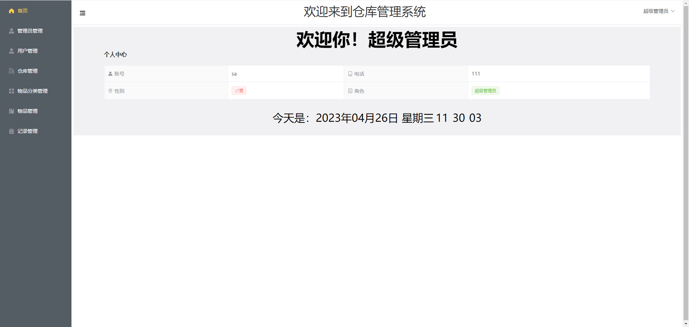
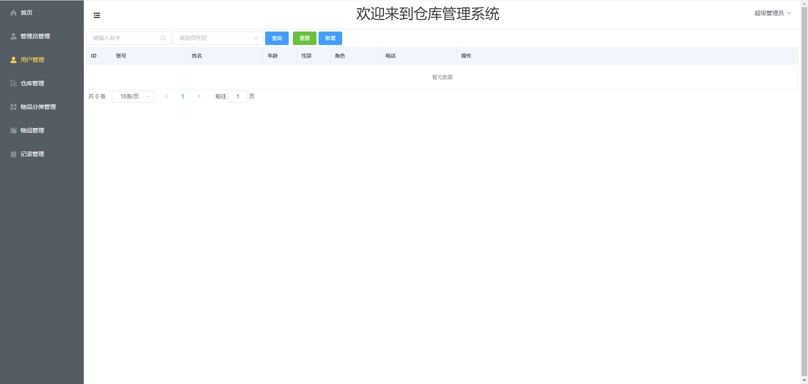
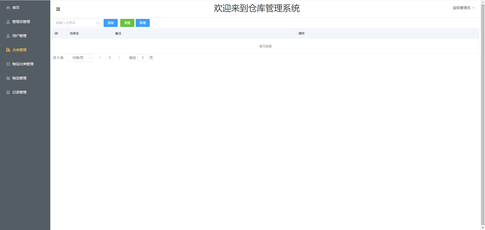
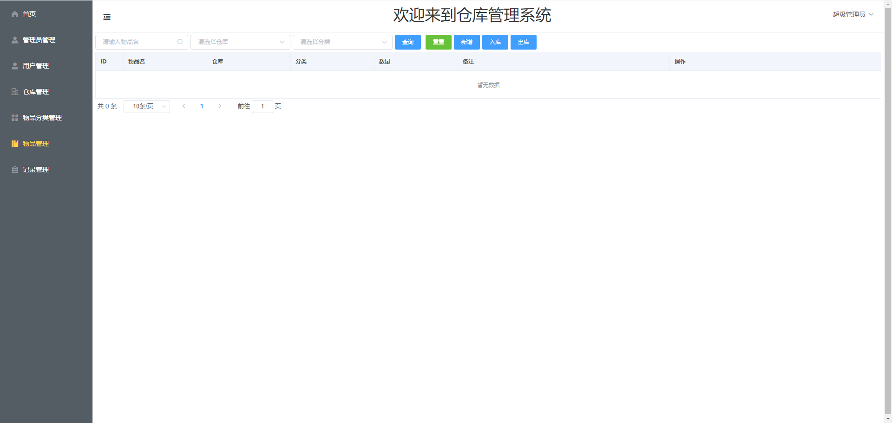
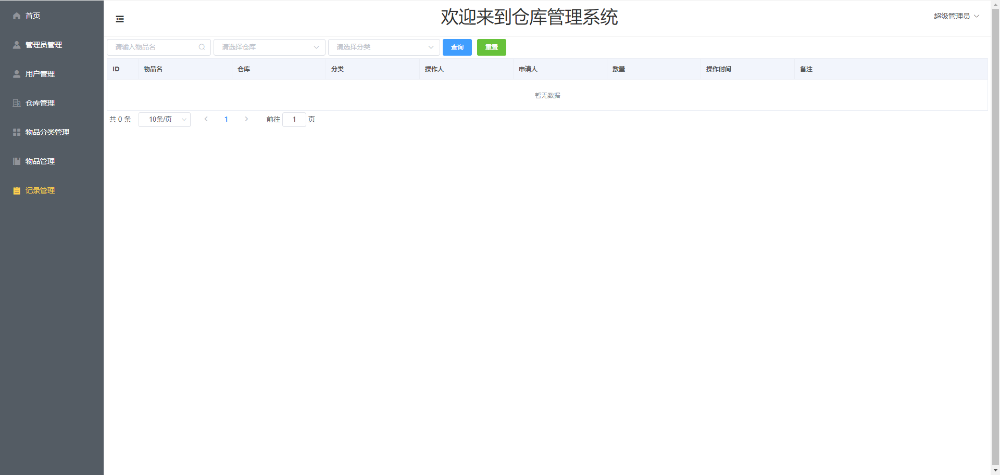

<p align="center"><a href='https://docs.oracle.com/en/java/javase/8'>
</a>
    <a href='https://docs.spring.io/spring-boot/docs/2.6.2-SNAPSHOT/reference/html'>

</a>
    <a href='https://staging-cn.vuejs.org'>

</a><br/>
    <a href='#'></a>
    <a href='#'></a>
    <a href='#'></a>
    <a href='#'></a>
</p>

# 仓库管理系统

#### 开发环境
Windows

#### 配置环境

| 程序           | 版本        | 说明                       |
|--------------|-----------|--------------------------|
| Jdk          | 1.8.0 161 | Java 开发工具包               |
| Mysql        | 5.5.27    | 关系型数据库                   |
| Apache-maven | 3.9.0     | Java 项目管理和构建工具           |
| Nvm          | 1.10      | Node.js 版本管理器            |
| Node         | 8.12.0    | Node.js JavaScript 运行时环境 |

#### 开发工具

| 工具                       | 版本            | 说明                      |
|--------------------------|---------------|-------------------------|
| IDEA                     | 2022.3.2      | 后前端开发IDE                |
| Git                      | 2.24.1        | 代码托管平台                  |
| Google   Chrome          | 75.0.3770.100 | 浏览器、前端调试工具              |
| Navicat                  | 11.1.13       | 数据库连接工具                 |
| Postman                  | 7.1.0         | 接口测试工具                  |
| VMware   Workstation Pro | 14.1.3        | 虚拟机(未用到或许你会用到)          |
| PowerDesigner            | 15            | 数据库设计工具(未用到或许你会用到)      |
| SQLyog                   | 12.0.3        | 数据库连接工具 (未用到或许你会用到)     |
| Visio                    | 2013          | 时序图、流程图等绘制工具(未用到或许你会用到) |
| ProcessOn                | ——            | 架构图等绘制工具(未用到或许你会用到)     |
| XMind   ZEN              | 9.2.0         | 思维导图绘制工具(未用到或许你会用到)     |
| RedisDesktop             | 0.9.3.817     | redis客户端连接工具(未用到或许你会用到) |

#### 编码规范

- 规范方式：严格遵守阿里编码规约。
- 命名统一：简介最大程度上达到了见名知意。
- 分包明确：层级分明可快速定位到代码位置。
- 注释完整：描述性高大量减少了开发人员的代码阅读工作量。
- 工具规范：使用统一jar包避免出现内容冲突。
- 代码整洁：可读性、维护性高。

#### 包结构

```
 +- wms-sb -- 后端
    +- .mvn
        +- wrapper
            +- maven-wrapper.jar -- Maven Wrapper插件的核心代码
            +- maven-wrapper.properties -- Maven Wrapper插件的配置文件
    +- src
    |   +- main
    |   |    +- java
    |   |    |    +- com
    |   |    |    |    +- wms
    |   |    |    |    |    +- common -- 通用的工具类、异常类、常量等
    |   |    |    |    |    +- controller -- 控制器类 负责接收和处理HTTP请求
    |   |    |    |    |    +- entity -- 实体类，用于存储数据
    |   |    |    |    |    +- mapper -- MyBatis框架的数据访问层
    |   |    |    |    |    +- service --  服务类，用于处理业务逻辑
    |   |    |    |    |    +- WmsApplication.java -- 应用程序入口类
    |   |    +- resources
    |   |        +- mapper -- MyBatis框架的SQL映射文件
    |   |        +- static -- 存放静态资源，如JavaScript、CSS和图片等
    |   |        +- templates -- 存放Thymeleaf模板文件
    |   |        +- application.yml -- 应用程序的配置信息
    |   +- sql -- 存放数据库脚本文件，如DDL和DML语句等
    |   +- test -- 测试代码
    |  	|	+- java
    |  	|	    +- com
    |  	|	        +- wms
    |  	|	            +- WmsApplicationTests.java -- 应用程序的单元测试用例
    +- target -- Maven建项目时自动生成的目录
    +- LICENSE -- 开源软件的授权协议
    +- pom.xml -- Maven项目的配置文件，存放项目的依赖信息等
    +- README.md -- 项目的相关信息文档
    +- wms.iml -- IntelliJ IDEA项目的配置文件
 +- wms-vue -- 前端
    +- public
        +- favicon.ico -- 图标文件
        +- index.html -- 首页HTML文件
    +- src
        +- assets -- 存放静态资源文件，如图片、字体等
        +- components -- 存放Vue组件文件，即前端UI组件
        +- router -- 存放Vue路由配置文件
        +- store -- 存放Vuex状态管理文件
        +- App.vue -- Vue根组件文件
        +- main.js -- Vue入口文件，用于创建Vue实例并挂载根组件
    +-  .gitignore -- Git版本控制忽略文件列表
    +-  bable.config.js -- Babel编译器的配置文件，用于将ES6及以上版本的JavaScript代码编译成ES5及以下版本的代码
    +-  LICENSE -- 开源软件的授权协议
    +-  package.json -- 项目依赖的NPM包及其版本信息
    +-  packge-lock.json -- NPM包的具体版本信息，用于保证项目的依赖版本不变 
    +-  README.md -- 项目的相关信息文档
```
#### 后端技术栈

| 技术                          | 版本            | 说明                  |
|-----------------------------|---------------|---------------------|
| spring-boot-starter-web     | 2.6.7         | Spring Boot Web应用程序 |
| mysql-connector-java        | 5.1.44        | MySQL数据库驱动程序        |
| lombok                      |               | 用于减少样板代码的Java库      |
| spring-boot-starter-test    | 2.6.7         | Spring Boot测试框架     |
| mybatis-plus-boot-starter   | 3.4.1         | MyBatis-Plus框架      |
| mybatis-plus-generator      | 3.4.1         | MyBatis-Plus代码生成器   |
| freemarker                  | 2.3.30        | 模板引擎                |
| spring-boot-starter-swagger | 1.5.1.RELEASE | Swagger UI界面和API文档  |
#### 前端技术栈

| 技术                    | 版本      | 说明                   |
|-----------------------|---------|----------------------|
| axios                 | ^0.27.2 | HTTP客户端              |
| core-js               | ^3.6.5  | ES6垫片                |
| element-ui            | ^2.15.9 | 基于Vue的组件库            |
| vue                   | ^2.6.11 | 前端框架                 |
| vue-router            | ^3.5.4  | Vue官方路由管理器           |
| vuex                  | ^3.0.0  | 状态管理模式               |
| babel-eslint          | ^10.1.0 | ESLint的Babel解析器      |
| eslint                | ^6.7.2  | 代码检查工具               |
| eslint-plugin-vue     | ^6.2.2  | ESLint插件，提供Vue代码检查能力 |
| vue-template-compiler | ^2.6.11 | Vue单文件组件编译器          |

#### 安装教程
- 1.数据库：在navicat中运行数据库脚本生成对应的数据库表
- 2.后台启动：导入项目，在src/main/resources/application.yml文件里更改数据库名称或数据库密码,进入控制台，到项目所在路径，执行命令：mvn clean spring-boot:run
- 3.前台启动：导入项目，进入控制台，到项目所在路径，执行命令：npm install 后 npm run serve，访问对应的地址进入到登录界面 用户名: sa 密码: 123 









#### 效果展示










